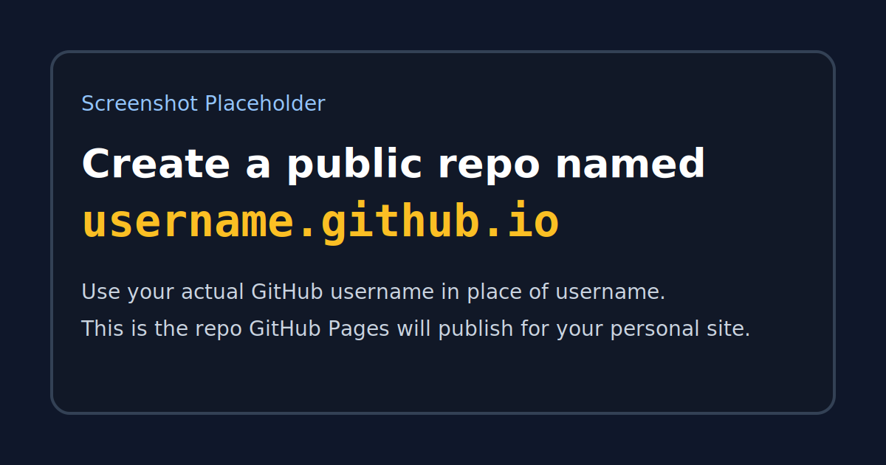
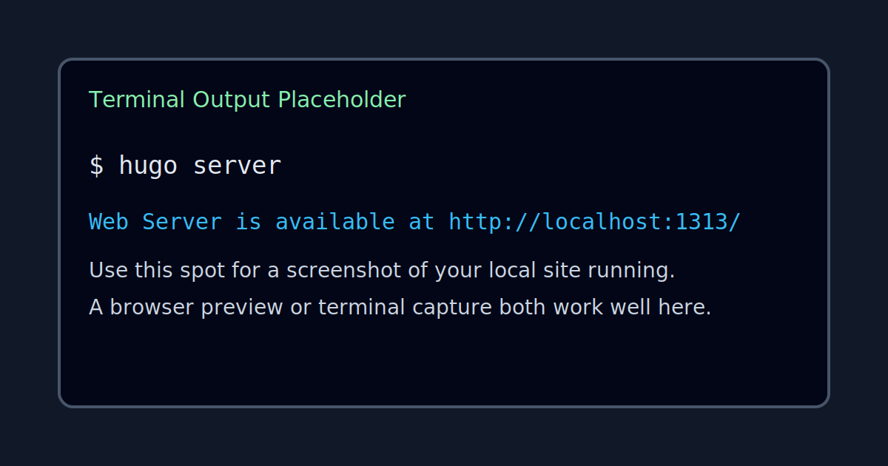
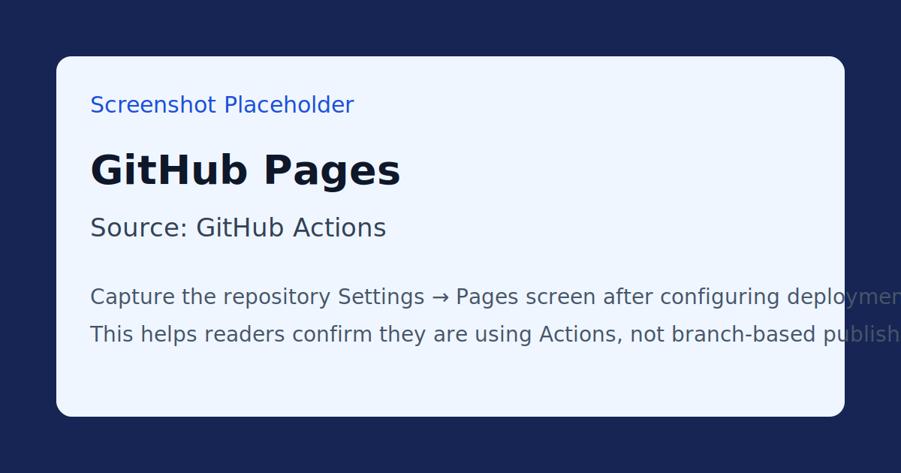

I wanted a simple way to publish blog posts for free, keep everything in GitHub, and avoid turning a personal blog into a full-time maintenance project. Hugo ended up being a good fit, but a lot of the setup guides I found were either too generic or too deep into Hugo internals.

So this is the version I wish I had when I started: a practical guide that gets you from zero to a working Hugo blog hosted on GitHub Pages.

This guide assumes:

- You are on Windows 10 or 11
- You are using PowerShell 7
- You want your blog source in GitHub
- You want a straightforward setup without unnecessary complexity
- You are happy using a simple theme like Tailwind

It also includes a GitHub Actions workflow so you can push to `main` and have the site deploy automatically.

<!--more-->

## TL;DR

If you want the short version, the overall flow looks like this:

1. Create a GitHub account and a public repo named `username.github.io`
2. Clone that repo locally
3. Install Git, PowerShell 7, Go, and Hugo Extended
4. Create a Hugo site inside a `site` folder
5. Add the Tailwind theme as a Git submodule
6. Update `site/hugo.toml` with your details
7. Create an About page and your first post
8. Add a GitHub Actions workflow
9. Push to `main`
10. Open `https://username.github.io`

If you want the full step-by-step version, keep going.

## 1. Prerequisites

Before you create the site, install the tools once and verify each one.

### 1.1 Create a GitHub account

If you do not already have one, create an account here:

https://github.com/

You will use GitHub both as the source repository and as the free host for the final site.

### 1.2 Install Git

Git is required because the theme will be added as a submodule.

Download:
https://git-scm.com/download/win

During install, select:
- Use Git from the command line and also from 3rd-party software

Verify:

```powershell
git --version
```

### 1.3 Install PowerShell 7

PowerShell 7 avoids the old BOM and encoding problems that can trip Hugo up on Windows.

Download:
https://learn.microsoft.com/powershell/

Verify:

```powershell
pwsh --version
```

### 1.4 Install Go

For this guide, the most reliable way to install Hugo Extended on Windows is via Go.

Download:
https://go.dev/dl/

Verify:

```powershell
go version
```

## 2. Create the GitHub Repository

To use GitHub Pages with your personal GitHub domain, create a new **public** repository named:

`username.github.io`

Replace `username` with your actual GitHub username.

For example, if your username is `commitconfirmed`, the repository must be:

`commitconfirmed.github.io`



## 3. Clone the Repository and Prepare the Folder Structure

Open PowerShell 7 and run:

```powershell
cd C:\LocalDevOps
git clone https://github.com/username/username.github.io.git
cd username.github.io
mkdir site
```

At this point your repository will hold the Hugo site inside a `site` directory, which keeps the root tidy.

### 3.1 Add a .gitignore

Create a `.gitignore` file in the repo root with:

```gitignore
# Hugo gitignores
/site/resources/
/site/public/
.hugo_build.lock
```

Commit and push this early if you want to confirm your repo and local tooling are working.

## 4. Install Hugo Extended on Windows

This is the part that usually causes the most friction on Windows.

The short version is:

- Do not rely blindly on Winget
- Do not assume an older `hugo.exe` on your PATH is the correct one
- Make sure you end up with **Hugo Extended**

### 4.1 Check for an Existing Hugo Install

```powershell
Get-Command hugo -ErrorAction SilentlyContinue
```

If a Hugo binary is already present and you want a clean reset:

```powershell
Remove-Item (Get-Command hugo).Source -Force
```

### 4.2 Install Hugo Extended via Go

Install Hugo Extended 0.160.1:

```powershell
go install -tags extended github.com/gohugoio/hugo@v0.160.1
```

This installs to:
`%USERPROFILE%\go\bin\hugo.exe`

Check your PATH:

```powershell
$env:PATH
```

Then verify Hugo:

```powershell
hugo version
```

You need to see `+extended` in the output. Something like:

`hugo v0.160.x+extended windows/amd64`

If `+extended` is missing, stop and fix that first.

## 5. Create the Hugo Site

Now move into the `site` folder and create the Hugo project there:

```powershell
cd C:\LocalDevOps\username.github.io\site
hugo new site .
```

You can test the bare site immediately:

```powershell
hugo server
```

Hugo will print a local URL, usually:

`http://localhost:1313`



## 6. Create a Safe Hugo Config

Because this guide is Windows-focused, I recommend writing the config file in PowerShell 7 with `utf8NoBOM`.

This avoids the BOM issues that sometimes happen when people use older editors or Windows PowerShell 5.1.

```powershell
@'
baseURL = "https://username.github.io/"
title = "My Blog"
author = "Your Name"
copyright = "Your Name"
pagination.pagerSize = 10
languageCode = "en"
theme = "tailwind"
enableRobotsTXT = true
enableEmoji = true

[markup]
    _merge = "deep"

[params]
    keywords = "some, keywords, here"
    subtitle = "blog subtitle"
    contentTypeName = "posts"
    showAuthor = true

    [params.author]
    name = "Your Name"
    email = "user@example.com"

    [params.header]
        logo = "logo.svg"
        title = "site title"

    [params.footer]
        since = 2025
        poweredby = true

        [[params.social_media.items]]
            enabled = true
            title = "Bluesky"
            icon = "brand-bluesky"
            link = "https://bsky.app/profile/yourname.bsky.social"

        [[params.social_media.items]]
            enabled = true
            title = "LinkedIn"
            icon = "brand-linkedin"
            link = "https://www.linkedin.com/in/yourname"

        [[params.social_media.items]]
            enabled = true
            title = "Github"
            icon = "brand-github"
            link = "https://github.com/yourname"

[menu]

    [[menu.main]]
        identifier = "post"
        name = "Posts"
        pageRef = "/posts"
        weight = 10

    [[menu.main]]
        identifier = "about"
        name = "About"
        pageRef = "/about"
        weight = 20

[taxonomies]
category = "categories"
tag = "tags"
series = "series"
'@ | Set-Content -Encoding utf8NoBOM hugo.toml
```

Replace `username`, `Your Name`, and the social links with your own details.

## 7. Add the Tailwind Theme

One of the reasons this setup is nice is that the Tailwind theme keeps things simple. You are not signing up for a heavy frontend toolchain just to publish a few posts.

From inside `site`, run:

```powershell
git submodule add https://github.com/tomowang/hugo-theme-tailwind.git themes/tailwind
```

That should also create a `.gitmodules` file in the repo root.

It should look roughly like this:

```ini
[submodule "site/themes/tailwind"]
	path = site/themes/tailwind
	url = https://github.com/tomowang/hugo-theme-tailwind.git
```

At this point, if `hugo server` is already running, Hugo should detect the config and theme changes and rebuild automatically.

## 8. Create the About Page and Your First Post

### 8.1 Create an About page

Create the About page:

```powershell
hugo new content about/index.md
```

Open `site/content/about/index.md` and replace the default content with your own details.

### 8.2 Create a blog post

Create your first post:

```powershell
hugo new content posts/my-first-post/index.md
```

Then use front matter like this:

```toml
+++
title = "Building and hosting your own Hugo blog on GitHub"
date = "2025-03-12"
description = "A guide to building and hosting a basic blog using Hugo on your personal GitHub account and GitHub Pages"
tags = [
        "hugo",
        "blog",
        "github",
        "github-pages",
]
categories = [
        "hugo",
]
series = ["Hugo"]
draft = false
+++
```

And then add your content below it, for example:

```markdown
## Blog header

blog text
```

Each post should live in its own folder with an `index.md` file. That makes it easy to add images later.

## 9. Run Locally While You Write

From the `site` folder:

```powershell
hugo server
```

Open:
http://localhost:1313

What you want to see:

- The site loads locally
- Theme styling is applied
- Your About page is visible
- Your first post appears on the homepage
- Hugo rebuilds automatically when you save changes

## 10. Add GitHub Actions Deployment

Once the blog looks right locally, set GitHub Pages to deploy from Actions.

In your repo:

1. Go to **Settings**
2. Open **Pages**
3. Set the source to **GitHub Actions**



Then create `.github/workflows/hugo.yml` in the repository root with this workflow:

```yaml
name: Build and deploy
env:
    FORCE_JAVASCRIPT_ACTIONS_TO_NODE24: "true"
on:
    push:
        branches:
            - main
    workflow_dispatch:
permissions:
    contents: read
    pages: write
    id-token: write
concurrency:
    group: pages
    cancel-in-progress: false
defaults:
    run:
        shell: bash
jobs:
    build:
        runs-on: ubuntu-latest
        env:
            DART_SASS_VERSION: 1.99.0
            GO_VERSION: 1.26.1
            HUGO_VERSION: 0.160.0
            NODE_VERSION: 24.14.1
            TZ: Europe/Oslo
        steps:
            - name: Checkout
                uses: actions/checkout@v6
                with:
                    submodules: recursive
                    fetch-depth: 0
            - name: Setup Go
                uses: actions/setup-go@v6
                with:
                    go-version: ${{ env.GO_VERSION }}
                    cache: false
            - name: Setup Node.js
                uses: actions/setup-node@v6
                with:
                    node-version: ${{ env.NODE_VERSION }}
            - name: Setup Pages
                id: pages
                uses: actions/configure-pages@v6
            - name: Create directory for user-specific executable files
                run: |
                    mkdir -p "${HOME}/.local"
            - name: Install Dart Sass
                run: |
                    curl -sLJO "https://github.com/sass/dart-sass/releases/download/${DART_SASS_VERSION}/dart-sass-${DART_SASS_VERSION}-linux-x64.tar.gz"
                    tar -C "${HOME}/.local" -xf "dart-sass-${DART_SASS_VERSION}-linux-x64.tar.gz"
                    rm "dart-sass-${DART_SASS_VERSION}-linux-x64.tar.gz"
                    echo "${HOME}/.local/dart-sass" >> "${GITHUB_PATH}"
            - name: Install Hugo
                run: |
                    curl -sLJO "https://github.com/gohugoio/hugo/releases/download/v${HUGO_VERSION}/hugo_extended_${HUGO_VERSION}_linux-amd64.tar.gz"
                    mkdir "${HOME}/.local/hugo"
                    tar -C "${HOME}/.local/hugo" -xf "hugo_extended_${HUGO_VERSION}_linux-amd64.tar.gz"
                    rm "hugo_extended_${HUGO_VERSION}_linux-amd64.tar.gz"
                    echo "${HOME}/.local/hugo" >> "${GITHUB_PATH}"
            - name: Verify installations
                run: |
                    echo "Dart Sass: $(sass --version)"
                    echo "Go: $(go version)"
                    echo "Hugo: $(hugo version)"
                    echo "Node.js: $(node --version)"
            - name: Install Node.js dependencies
                run: |
                    [[ -f package-lock.json || -f npm-shrinkwrap.json ]] && npm ci || true
            - name: Configure Git
                run: |
                    git config core.quotepath false
            - name: Cache restore
                id: cache-restore
                uses: actions/cache/restore@v5
                with:
                    path: ${{ runner.temp }}/hugo_cache
                    key: hugo-${{ github.run_id }}
                    restore-keys:
                        hugo-
            - name: Build the site
                run: |
                    hugo build \
                        --gc \
                        --minify \
                        --baseURL "${{ steps.pages.outputs.base_url }}/" \
                        --cacheDir "${{ runner.temp }}/hugo_cache"
            - name: Cache save
                id: cache-save
                uses: actions/cache/save@v5
                with:
                    path: ${{ runner.temp }}/hugo_cache
                    key: ${{ steps.cache-restore.outputs.cache-primary-key }}
            - name: Upload artifact
                uses: actions/upload-pages-artifact@v3
                with:
                    path: ./public
    deploy:
        if: github.ref == 'refs/heads/main'
        environment:
            name: github-pages
            url: ${{ steps.deployment.outputs.page_url }}
        runs-on: ubuntu-latest
        needs: build
        steps:
            - name: Deploy to GitHub Pages
                id: deployment
                uses: actions/deploy-pages@v5
```

## 11. Commit, Push, and Publish

From the repo root:

```powershell
git add .
git commit -m "Initial Hugo blog setup"
git push origin main
```

Once the workflow completes, your site should be available at:

`https://username.github.io`

## Verification Checklist

Before sharing or deploying, confirm all of these:

- `hugo version` includes `+extended`
- Hugo is version 0.160 or newer
- `Get-Command hugo` returns one intended binary path
- `hugo server` runs cleanly
- The theme is applied locally
- The GitHub Actions workflow completes successfully
- GitHub Pages is set to deploy from Actions
- Your site opens at `https://username.github.io`

## Common Mistakes (And What They Cause)

| Mistake | Result |
|---|---|
| Editing config in Notepad | BOM can break parsing |
| Using Windows PowerShell 5.1 for file generation | BOM/encoding issues |
| Installing Hugo with Winget without checking version | Old/incorrect build |
| Using standard Hugo instead of Extended | SCSS fails |
| Multiple Hugo binaries in PATH | Version conflicts |
| Creating the wrong repo name | Your personal GitHub Pages URL will not work as expected |
| Forgetting to set Pages source to Actions | Workflow runs, but site does not publish |
| Leaving draft posts as drafts | Content does not show up on the live site |

## Recommended Tooling

- Editor: VS Code
- Shell: PowerShell 7
- Install method: Go (`go install -tags extended ...`)
- Theme strategy: Git submodules or Hugo modules
- Hosting: GitHub Pages via GitHub Actions

## Optional Extras

Once the basics are working, the next things you might want to add are:

- A custom domain
- Better post images
- Analytics
- Comments
- A cleaner About page
- A reusable post template
- Local development in Docker Compose or GitHub Codespaces

## Final Thoughts

Hugo is one of those tools that can scale from a tiny personal blog to a much more involved static site, which is great, but it also means a lot of guides try to teach everything at once.

If all you want is a simple blog that lives in GitHub, deploys for free, and stays easy to manage, this setup is enough to get you there without dragging in a full frontend toolchain.

If you want, I can turn this into a shorter publish-ready version next, or add a matching follow-up post for Docker Compose or GitHub Codespaces.
