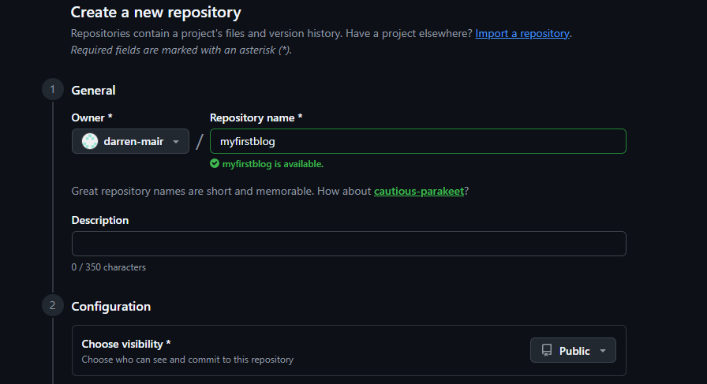
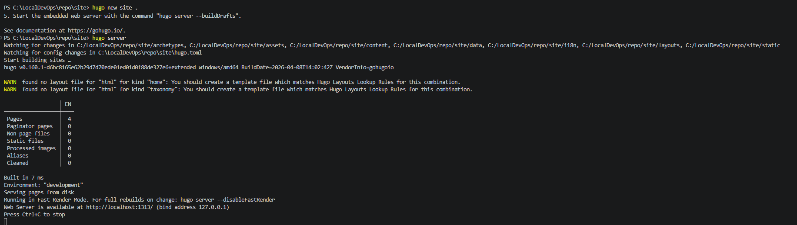
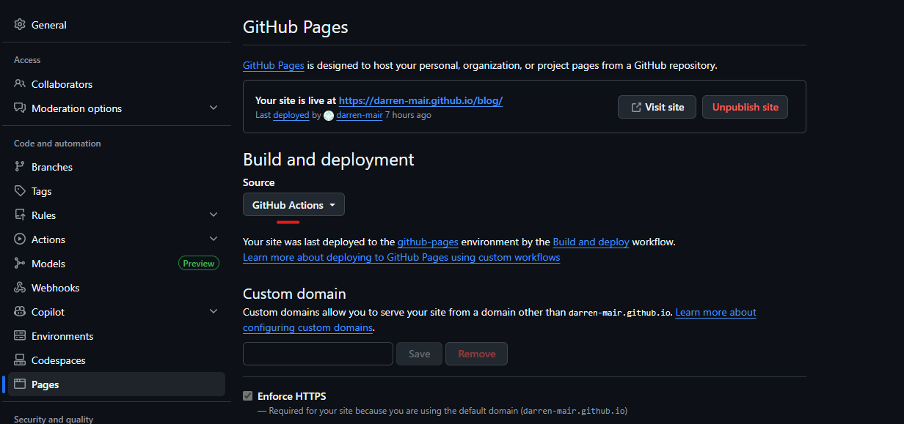

## Introduction

I wanted a simple way to publish blog posts for free, keep everything in GitHub, and avoid turning a personal blog into a full-time maintenance project. Hugo ended up being a good fit, but a lot of the setup guides I found were either too generic or too deep into Hugo internals.

So this is the version I wish I had when I started: a practical guide that gets you from zero to a working Hugo blog hosted on GitHub Pages.

## Prerequisites

This guide assumes:

- You are on Windows 10 or 11
- You are using PowerShell 7
- You want your blog source in GitHub
- You want a straightforward setup without unnecessary complexity
- You are happy using a simple theme like Tailwind
- GitHub Account, create one here https://github.com/


<!--more-->

## TL;DR

If you want the short version, the overall flow looks like this:

1. Create a GitHub account and a public repo named `username.github.io`
2. Clone that repo locally
3. Install Git, PowerShell 7, Go, and Hugo Extended
4. Create a Hugo site inside a `site` folder
5. Add the Tailwind theme as a Git submodule
6. Update `site/hugo.toml` with your details
7. Create an About page and your first post
8. Add a GitHub Actions workflow
9. Push to `main`
10. Open `https://username.github.io`

If you want the full step-by-step version, keep going.

## Installation

### Install Git

Git is required because the theme will be added as a submodule.

Download:
https://git-scm.com/download/win

During install, select:
- Use Git from the command line and also from 3rd-party software

Verify:

```powershell
git --version
```

### Install or verify PowerShell 7

PowerShell 7 avoids the old BOM and encoding problems that can trip Hugo Extended up on Windows.

Download:
https://learn.microsoft.com/powershell/

Verify:

```powershell
pwsh --version
```

### Install Hugo Extended
#### Download Hugo

```powershell
Invoke-WebRequest -Uri "https://github.com/gohugoio/hugo/releases/download/v0.160.1/hugo_extended_0.160.1_windows-amd64.zip" -OutFile "hugo_extended.zip"
```

You can change the version number (0.160.1) with the latest release from Hugo’s [Github Releases page](https://github.com/gohugoio/hugo/releases). 


#### Extract Hugo

Once the download is complete, run the following command to extract the ZIP file to a directory (e.g., C:\Hugo):

```powershell
Expand-Archive -Path hugo_extended.zip -DestinationPath C:\Hugo
```

#### Add Hugo to System Path

To make Hugo accessible from anywhere in PowerShell, you need to add it to the system’s PATH variable.

- Press Windows + X > System > Advanced system settings.   
- Click `**Environment Variables**`.  
- Under System Variables, find Path and click Edit.  
- Click New, then add the path C:\Hugo where you extracted hugo.exe.

Click OK to save the changes.

#### Verify Hugo Installation

Now, open PowerShell and run:
```powershell
hugo version
````

You should see the installed version of Hugo, confirming that it’s set up correctly.


### Create the GitHub Repository

To use GitHub Pages with your personal GitHub domain, create a new **public** repository named:

`username.blogname`

Replace `username` with your actual GitHub username.

For example, if your username is `scoobydoo`, the repository must be:

`scoobydoo.reponame`



### Clone the Repository and Prepare the Folder Structure

Open PowerShell 7 and run:

```powershell
cd C:\LocalDevOps
git clone https://github.com/username/reponame.git
cd reponame`
mkdir site
```

At this point your repository will hold the Hugo site inside a `site` directory, which keeps the root tidy.

### Add a .gitignore

Create a `.gitignore` file in the repo root with:

```gitignore
# Hugo gitignores
/site/resources/
/site/public/
.hugo_build.lock
```

Commit and push this early if you want to confirm your repo and local tooling are working.


## Create your first Hugo site 

Now move into the `site` folder and create the Hugo project there:

```powershell
cd C:\LocalDevOps\repo\site
hugo new site .
```

You can test the bare site immediately:

```powershell
hugo server
```

Hugo will print a local URL, usually:

`http://localhost:1313`




## Add the Tailwind Theme

One of the reasons this setup is nice is that the Tailwind theme keeps things simple. You are not signing up for a heavy frontend toolchain just to publish a few posts.

From inside `site`, run:

```
git init
git submodule add https://github.com/tomowang/hugo-theme-tailwind.git themes/tailwind
```

### Activate the Theme
Once the theme is downloaded, open the config.toml file in your Hugo project folder:

Add the following line to the file to set the theme:

theme = "tailwind"
That should also create a `.gitmodules` file in the repo root.


It should look roughly like this:

```ini
[submodule "site/themes/tailwind"]
	path = site/themes/tailwind
	url = https://github.com/tomowang/hugo-theme-tailwind.git
```

At this point, if `hugo server` is already running, Hugo should detect the config and theme changes and rebuild automatically.

## Create the About Page and Your First Post


```powershell
hugo new content about/index.md
```

Open `site/content/about/index.md` and replace the default content with your own details.

```toml
---
title: About
description: Everything you need to know about this site and its author.
date: 2026-01-26
lastmod: 2026-01-26
menu:
    main: 
        weight: -90
        params:
            icon: user
---
````


### Create a blog post

Create your first post:

```powershell
hugo new content posts/my-first-post/index.md
```

Then use front matter like this:

```toml
+++
date = '2026-04-15T23:13:41+01:00'
draft = false
title = 'My First Post'
+++

## Title Test
Welcome to my first post on my new Hugo website!

```

And then add your content below it, for example:

```markdown
## Blog header

blog text
```

Each post should live in its own folder with an `index.md` file. That makes it easy to add images later.

## Run Locally While You Write

From the `site` folder:

```powershell
hugo server
```

Open:
http://localhost:1313

What you want to see:

- The site loads locally
- Theme styling is applied
- Your About page is visible
- Your first post appears on the homepage
- Hugo rebuilds automatically when you save changes

## Add GitHub Actions Deployment

Once the blog looks right locally, set GitHub Pages to deploy from Actions.

In your repo:

1. Go to **Settings**
2. Open **Pages**
3. Set the source to **GitHub Actions**



Then create `.github/workflows/hugo.yml` in the repository root with this workflow:

```yaml
name: Build and deploy
env:
    FORCE_JAVASCRIPT_ACTIONS_TO_NODE24: "true"
on:
    push:
        branches:
            - main
    workflow_dispatch:
permissions:
    contents: read
    pages: write
    id-token: write
concurrency:
    group: pages
    cancel-in-progress: false
defaults:
    run:
        shell: bash
jobs:
    build:
        runs-on: ubuntu-latest
        env:
            DART_SASS_VERSION: 1.99.0
            GO_VERSION: 1.26.1
            HUGO_VERSION: 0.160.0
            NODE_VERSION: 24.14.1
            TZ: Europe/Oslo
        steps:
            - name: Checkout
                uses: actions/checkout@v6
                with:
                    submodules: recursive
                    fetch-depth: 0
            - name: Setup Go
                uses: actions/setup-go@v6
                with:
                    go-version: ${{ env.GO_VERSION }}
                    cache: false
            - name: Setup Node.js
                uses: actions/setup-node@v6
                with:
                    node-version: ${{ env.NODE_VERSION }}
            - name: Setup Pages
                id: pages
                uses: actions/configure-pages@v6
            - name: Create directory for user-specific executable files
                run: |
                    mkdir -p "${HOME}/.local"
            - name: Install Dart Sass
                run: |
                    curl -sLJO "https://github.com/sass/dart-sass/releases/download/${DART_SASS_VERSION}/dart-sass-${DART_SASS_VERSION}-linux-x64.tar.gz"
                    tar -C "${HOME}/.local" -xf "dart-sass-${DART_SASS_VERSION}-linux-x64.tar.gz"
                    rm "dart-sass-${DART_SASS_VERSION}-linux-x64.tar.gz"
                    echo "${HOME}/.local/dart-sass" >> "${GITHUB_PATH}"
            - name: Install Hugo
                run: |
                    curl -sLJO "https://github.com/gohugoio/hugo/releases/download/v${HUGO_VERSION}/hugo_extended_${HUGO_VERSION}_linux-amd64.tar.gz"
                    mkdir "${HOME}/.local/hugo"
                    tar -C "${HOME}/.local/hugo" -xf "hugo_extended_${HUGO_VERSION}_linux-amd64.tar.gz"
                    rm "hugo_extended_${HUGO_VERSION}_linux-amd64.tar.gz"
                    echo "${HOME}/.local/hugo" >> "${GITHUB_PATH}"
            - name: Verify installations
                run: |
                    echo "Dart Sass: $(sass --version)"
                    echo "Go: $(go version)"
                    echo "Hugo: $(hugo version)"
                    echo "Node.js: $(node --version)"
            - name: Install Node.js dependencies
                run: |
                    [[ -f package-lock.json || -f npm-shrinkwrap.json ]] && npm ci || true
            - name: Configure Git
                run: |
                    git config core.quotepath false
            - name: Cache restore
                id: cache-restore
                uses: actions/cache/restore@v5
                with:
                    path: ${{ runner.temp }}/hugo_cache
                    key: hugo-${{ github.run_id }}
                    restore-keys:
                        hugo-
            - name: Build the site
                run: |
                    hugo build \
                        --gc \
                        --minify \
                        --baseURL "${{ steps.pages.outputs.base_url }}/" \
                        --cacheDir "${{ runner.temp }}/hugo_cache"
            - name: Cache save
                id: cache-save
                uses: actions/cache/save@v5
                with:
                    path: ${{ runner.temp }}/hugo_cache
                    key: ${{ steps.cache-restore.outputs.cache-primary-key }}
            - name: Upload artifact
                uses: actions/upload-pages-artifact@v3
                with:
                    path: ./public
    deploy:
        if: github.ref == 'refs/heads/main'
        environment:
            name: github-pages
            url: ${{ steps.deployment.outputs.page_url }}
        runs-on: ubuntu-latest
        needs: build
        steps:
            - name: Deploy to GitHub Pages
                id: deployment
                uses: actions/deploy-pages@v5
```

## 11. Commit, Push, and Publish

From the repo root:

```powershell
git add .
git commit -m "Initial Hugo blog setup"
git push origin main
```

Once the workflow completes, your site should be available at:

`https://username.github.io/reponame`

## Verification Checklist

Before sharing or deploying, confirm all of these:

- `hugo version` includes `+extended`
- Hugo is version 0.160 or newer
- `Get-Command hugo` returns one intended binary path
- `hugo server` runs cleanly
- The theme is applied locally
- The GitHub Actions workflow completes successfully
- GitHub Pages is set to deploy from Actions
- Your site opens at `https://username.github.io`

## Common Mistakes (And What They Cause)

| Mistake | Result |
|---|---|
| Editing config in Notepad | BOM can break parsing |
| Using Windows PowerShell 5.1 for file generation | BOM/encoding issues |
| Installing Hugo with Winget without checking version | Old/incorrect build |
| Using standard Hugo instead of Extended | SCSS fails |
| Multiple Hugo binaries in PATH | Version conflicts |
| Creating the wrong repo name | Your personal GitHub Pages URL will not work as expected |
| Forgetting to set Pages source to Actions | Workflow runs, but site does not publish |
| Leaving draft posts as drafts | Content does not show up on the live site |

## Recommended Tooling

- Editor: VS Code
- Shell: PowerShell 7
- Theme strategy: Git submodules or Hugo modules
- Hosting: GitHub Pages via GitHub Actions

## Optional Extras

Once the basics are working, the next things you might want to add are:

- A custom domain
- Better post images
- Analytics
- Comments
- A cleaner About page
- A reusable post template
- Local development in Docker Compose or GitHub Codespaces

## Final Thoughts

Hugo is one of those tools that can scale from a tiny personal blog to a much more involved static site, which is great, but it also means a lot of guides try to teach everything at once.

If all you want is a simple blog that lives in GitHub, deploys for free, and stays easy to manage, this setup is enough to get you there without dragging in a full frontend toolchain.

If you want, I can turn this into a shorter publish-ready version next, or add a matching follow-up post for Docker Compose or GitHub Codespaces.

# Happy Blogging!